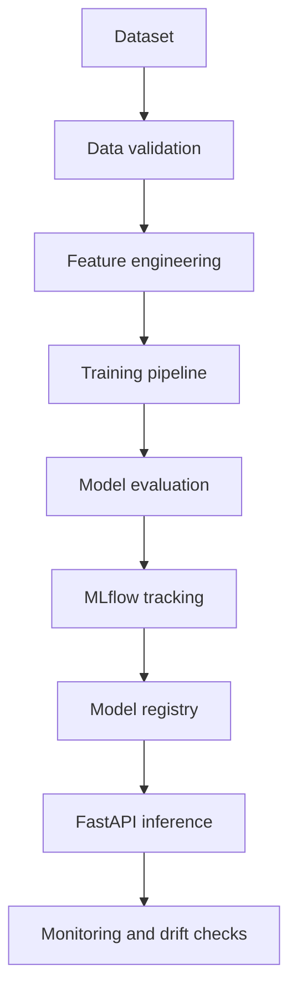

# Customer Churn Intelligence

Portfolio engineering project combining Customer Experience, Customer Success,
applied machine learning and MLOps.

> **Current status: Phase 5C — data preparation complete.** This repository does not yet
> claim a trained model, production traffic, real customers or real business
> outcomes. Feature preparation and reproducible splitting are implemented;
> model training, evaluation, serving and MLflow remain future work.

## Purpose

The intended product will estimate customer churn risk from a documented,
public or explicitly synthetic dataset. It will demonstrate a reproducible
path from data validation to model evaluation and controlled inference, with
limitations and bias considerations documented instead of hidden.

## Phase 5A--5C foundation

- Python 3.12 package using a `src/` layout;
- FastAPI process with a minimal `/health` liveness endpoint;
- Pydantic Settings for environment-backed configuration;
- Pandas-based dataset acquisition and validation foundation;
- explicit leakage-reviewed feature contract with three row-wise derived features;
- deterministic 70/15/15 target-stratified splitting with feature-vector grouping;
- Ruff for linting and formatting-compatible checks;
- mypy in strict mode;
- pytest and an HTTP smoke test;
- public-safe `.env.example` with no credentials;
- GitHub Actions workflow with read-only repository permissions.

## Planned architecture



## Local setup

```bash
python -m venv .venv
# Windows PowerShell: .venv\\Scripts\\Activate.ps1
python -m pip install --upgrade pip
python -m pip install -e ".[dev]"
ruff check .
mypy
pytest
```

No database, model artifact or external service is required for the completed
data preparation phases.

## Dataset and data validation

Phase 5B selects the documented [UCI Iranian Churn dataset](docs/DATASET.md).
The raw CSV is acquired reproducibly and kept out of Git; the pipeline records
source metadata and SHA-256 checksums, validates schema/types/ranges/categories,
and produces a JSON quality report. See the [data dictionary](docs/DATA_DICTIONARY.md)
and [data card](DATA_CARD.md).

Phase 5C prepares nine safe raw features plus three transparent ratios, excludes
demographic and temporal-review fields, and writes a deterministic preparation
report without materializing split files. See the [feature contract](docs/FEATURES.md)
and [split strategy](docs/SPLIT_STRATEGY.md).

**NO MODEL TRAINED YET.** No accuracy, ROC-AUC or churn probability is reported.

## Safety boundary

This is a portfolio engineering project. It must use public or synthetic data
only, avoid unnecessary personal information, and never use production
databases or credentials during development or testing.

## License

MIT. See [LICENSE](LICENSE).
