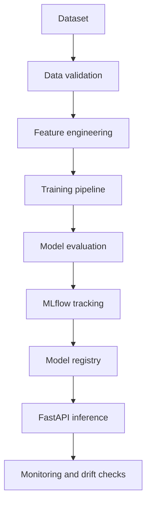

# Customer Churn Intelligence

Portfolio engineering project combining Customer Experience, Customer Success,
applied machine learning and MLOps.

> **Current status: Phase 5A — bootstrap only.**  This repository does not yet
> claim a trained model, production traffic, real customers or real business
> outcomes. The dataset, feature pipeline, evaluation protocol, model serving
> and MLflow integration will be added in later phases.

## Purpose

The intended product will estimate customer churn risk from a documented,
public or explicitly synthetic dataset. It will demonstrate a reproducible
path from data validation to model evaluation and controlled inference, with
limitations and bias considerations documented instead of hidden.

## Phase 5A foundation

- Python 3.12 package using a `src/` layout;
- FastAPI process with a minimal `/health` liveness endpoint;
- Pydantic Settings for environment-backed configuration;
- Ruff for linting and formatting-compatible checks;
- mypy in strict mode;
- pytest and an HTTP smoke test;
- public-safe `.env.example` with no credentials;
- GitHub Actions workflow with read-only repository permissions.

## Planned architecture



## Local setup

```bash
python -m venv .venv
# Windows PowerShell: .venv\\Scripts\\Activate.ps1
python -m pip install --upgrade pip
python -m pip install -e ".[dev]"
ruff check .
mypy
pytest
```

No database, model artifact or external service is required for Phase 5A.

## Safety boundary

This is a portfolio engineering project. It must use public or synthetic data
only, avoid unnecessary personal information, and never use production
databases or credentials during development or testing.

## License

MIT. See [LICENSE](LICENSE).

